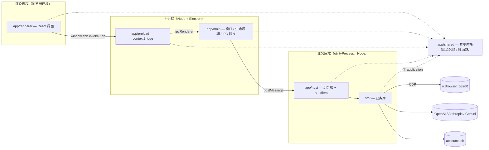

# 架构规范

> 本文件是本项目架构的**唯一权威依据**。代码与本文不一致时，要么改代码，要么先改本文并说明理由。
> 分层依赖规则由 `check:deps` 自动检查（dependency-cruiser，见 [§3](#3-依赖规则)）；其余条款靠评审把关。
> 现有代码与本文不符之处统一登记在 [§9 当前偏差](#9-当前偏差)。

## 1. 概览

ixBrowser 自动化管理工具：Electron 桌面应用，驱动 ixBrowser 指纹浏览器批量管理 Google 账号。



```text
app/main      Electron 主进程：窗口、生命周期、IPC 转发、拉起后端进程
app/preload   contextBridge 暴露最小 API（invoke / on / channels / platform）
app/renderer  React 界面
app/host      业务后端（utilityProcess）：组合根 + IPC handler
app/shared    共享内核：三端共用，Node 与浏览器都能跑，不依赖任何其它目录
  ├─ ipc.ts / envelope.ts   传输层：通道总表、白名单、信封
  ├─ channels/*.ts          IPC 契约：通道名、参数 / 返回 DTO、枚举常量
  └─ logic/*.ts             纯函数：界面与后端都要用的同一套规则
src/          业务库，不依赖 Electron
  ├─ application  用例编排
  ├─ automation   单账号业务流程
  ├─ engine       浏览器自动化（Stagehand 门面 + operations）
  ├─ db           SQLite 仓储
  ├─ ixbrowser    ixBrowser 本地 API 客户端
  ├─ services     本地数据服务（代理分配等）
  └─ core         最底层工具
```

## 2. 进程职责与安全基线

### 2.1 进程职责

依据 Electron 官方 [Process Model](https://www.electronjs.org/docs/latest/tutorial/process-model)：主进程是唯一入口；渲染层默认没有 Node 能力；预加载经 `contextBridge` 暴露 API；后台工作优先放 `utilityProcess`，而不是 `child_process.fork`。

| 进程 / 目录 | 负责 | 不做 |
|---|---|---|
| `app/main` | 创建窗口、导航与新窗口拦截、IPC 白名单与来源校验、把请求转发给后端、后端进程生命周期（串行队列、超时、崩溃后请求以 `HOST_UNAVAILABLE` 失败） | 不 import `src/` 与 `app/host`；不写业务逻辑 |
| `app/preload` | 只暴露 `window.abb = { invoke, on, channels, platform }`，并校验通道类型 | 不暴露 `ipcRenderer` 本体，不做业务 |
| `app/renderer` | 界面、交互、确认框；经 `app/renderer/src/lib/ipc.ts` 的 `invoke` / `on` 调后端；状态用基于 `useSyncExternalStore` 的 store（`app/renderer/src/stores/`） | 不 import `src/`、`node:*`、electron；不自己算业务结论 |
| `app/host` | 组合根（`context.ts` 创建数据库、仓储、配置、ixBrowser 客户端，均惰性打开）；`dispatch.ts` 按通道分发；`task-runner.ts` 管后台任务（全局单任务、停止、进度、逐条目、任务历史落库）；`handlers/` 处理各通道 | 不依赖 electron 与界面代码 |
| `app/shared` | IPC 契约与三端共用的纯函数 | 不依赖任何其它目录，不用 Node 专有或 DOM 专有 API |

后端跑在 `utilityProcess` 里：业务代码崩溃只影响后端，窗口不受影响；界面可以手动「重启后端」。

### 2.2 安全基线（对照 Electron [Security Checklist](https://www.electronjs.org/docs/latest/tutorial/security)）

| 清单条目 | 本项目做法 | 位置 |
|---|---|---|
| 启用 Context Isolation、关闭 Node 集成、启用进程沙箱 | `contextIsolation: true`、`nodeIntegration: false`、`sandbox: true`、`webSecurity: true`、`webviewTag: false`（开了 sandbox，预加载必须打成 CJS） | `app/main/window.ts:49-53` |
| 定义 Content Security Policy | 生产 `script-src 'self'`，不含 `'unsafe-inline'`；仅开发模式由 `devRelaxCsp()` 放宽（React Fast Refresh 需要） | `app/renderer/index.html:14`、`electron.vite.config.ts` |
| 限制新窗口与导航 | `setWindowOpenHandler` 拒绝应用外地址；`will-navigate` 只放行应用自身页面（`isAppUrl`）；禁止挂载 webview | `app/main/window.ts:65,78,82`、`app/main/navigation.ts:33` |
| 校验所有 IPC 消息的发送方 | 通道白名单 + 只接受本应用页面发来的请求，否则返回 `FORBIDDEN` | `app/main/ipc/registrar.ts:58,80`、`app/main/index.ts:86` |
| 预加载只暴露最小 API | 见 §2.1 | `app/preload/index.ts:42` |

新增窗口、webview、外链打开、IPC 通道时，必须保持上表每一项成立。

## 3. 依赖规则

### 3.1 原则

- **依赖只能向内**。Microsoft [Clean Architecture](https://learn.microsoft.com/en-us/dotnet/architecture/modern-web-apps-azure/common-web-application-architectures)：「dependencies flow toward the innermost circle… both the UI and the Infrastructure layers depend on the Application Core, but not on one another」。Cockburn [Hexagonal Architecture](https://alistair.cockburn.us/hexagonal-architecture/)：「code pertaining to the inside part should not leak into the outside part」。
- **契约放在被依赖的一侧**：接口约定由被依赖方定义，依赖方向它看齐。
- **三端共用的代码必须两边都能跑**：electron-vite 把 main / preload 按 Node 目标构建、renderer 按浏览器（Chrome）目标构建（[Config Reference](https://electron-vite.org/config/)）。

### 3.2 允许的依赖方向

```text
app/renderer ─┐
app/preload  ─┼──▶ app/shared ◀── app/host ──▶ src/*
app/main     ─┘        ▲
                       └──── src/application（只能看 channels/ 与 logic/）

src/application ──▶ automation ──▶ engine ──▶ ixbrowser
       │               │              │
       └──▶ db · ixbrowser · services · core ◀──┘        services ──▶ db
                                                          core 不依赖 src 其它目录
```

### 3.3 规则表

每条规则对应 `.dependency-cruiser.cjs` 里的同名规则，`pnpm run check:deps` 检查（有 error 即非零退出）。

| 规则名 | 级别 | 内容 |
|---|---|---|
| `no-circular` | error | 不得有运行时循环依赖；只由 `import type` 形成的环不算 |
| `not-to-unresolvable` | error | 不得有解析不到的导入 |
| `no-orphans` | error | 除入口外，每个模块都必须被引用。入口：`app/main/index.ts`、`app/host/index.ts`、`app/preload/index.ts`、`app/renderer/src/main.tsx`、`src/ixbrowser/probe.ts`、`src/db/probe.ts`、`*.d.ts` |
| `shared-is-self-contained` | error | `app/shared` 只依赖自身（外部 npm 包除外） |
| `shared-no-node` | error | `app/shared` 不用 Node 内置模块 |
| `shared-no-electron` | error | `app/shared` 不依赖 electron（上一条放行 npm 包，electron 需单独拦） |
| `renderer-only-shared` | error | 渲染层不依赖 `src/`、`app/host`、`app/main`、`app/preload` |
| `renderer-no-node` | error | 渲染层不用 Node 内置模块 |
| `renderer-no-electron` | error | 渲染层不依赖 electron |
| `main-is-thin` | error | 主进程不依赖 `src/`、`app/host`、`app/renderer`、`app/preload` |
| `preload-only-shared` | error | 预加载不依赖 `src/`、`app/host`、`app/renderer`、`app/main` |
| `host-no-electron-or-ui` | error | 后端不依赖 electron、`app/main`、`app/renderer`、`app/preload` |
| `handlers-via-application` | error | `app/host/handlers` 不直接依赖 `src/automation`、`src/engine`（组合根 `app/host/context.ts`、`app/host/index.ts` 例外） |
| `src-no-electron` | error | `src/` 不依赖 electron |
| `src-only-application-sees-contracts` | error | `src/` 里只有 `application` 可以依赖 `app/` |
| `application-only-contracts` | error | `src/application` 只能依赖 `app/shared/channels/` 与 `app/shared/logic/` |
| `automation-not-up` | error | automation 不依赖 application、services |
| `engine-not-up` | error | engine 不依赖 application、automation、db、services |
| `services-not-up` | error | services 不依赖 application、automation、engine |
| `infra-not-up` | error | db、ixbrowser 不依赖 application、automation、engine、services |
| `core-is-leaf` | error | core 不依赖 `src/` 其它目录 |

仅类型导入（`import type`）同样受分层规则约束：渲染层不能靠 `import type` 引用 `src/`。

### 3.4 两条设计决定

**`app/shared` 是共享内核。** 它不依赖任何目录，所有进程都可以依赖它。IPC 契约（通道名、DTO、枚举常量）只在 `app/shared/channels/` 定义一份，主进程、后端、渲染层共用。这样做而不是把 DTO 放进 `src/`，是因为那会让 `app/shared` 反过来依赖 `src/`，渲染层就能间接碰到业务库。

**`src/` 里只有 `application` 能看见契约。** 用例的输入输出就是 IPC DTO，所以 `application` 可以引用 `app/shared/channels/`；同时可以引用 `app/shared/logic/`（两端共用的纯函数）。`automation` / `engine` / `db` / `ixbrowser` / `services` / `core` 不知道 IPC 的存在；`application` 也不能引用传输层 `ipc.ts` / `envelope.ts`。

## 4. 各层职责

| 层 | 负责 | 约束 |
|---|---|---|
| `app/host/handlers` | 解析并校验参数 → 调用例 → 返回结果或 `TaskInfo` | 不写批处理循环、事务、业务判断；不直接执行 SQL；不直接创建仓储 / DataStore / ProxyAllocator（它们由组合根提供） |
| `src/application` | 用例编排：一个用户动作对应一个函数；批处理循环、停止、进度、逐条目上报、结果汇总、确认文案 | 通过参数注入仓储、客户端、配置，不自己去找 |
| `src/automation` | 单账号业务流程：连引擎、跑 operation、确认成功后写回本地 | Google 侧没确认成功时，本地一个字段都不动 |
| `src/engine` | 浏览器自动化：`StagehandGoogleEngine` 门面 + `operations/` | 只操作页面，不碰数据库；见 [§7](#7-引擎约定) |
| `src/db` | SQLite 建表、迁移、仓储；跨多条语句的一致性写入用仓储方法内的事务 | 调用方不写 SQL |
| `src/ixbrowser` | ixBrowser 本地 API 客户端与窗口辅助函数 | — |
| `src/services` | 本地数据服务（代理数据、代理分配） | — |
| `src/core` | 配置读写与敏感字段加解密、重试、随机密码、TOTP 解析、信号量 | 不依赖 `src/` 其它目录 |

组合根是 `app/host/context.ts` 与 `app/host/index.ts`：只有它们创建数据库连接、仓储、配置对象、ixBrowser 客户端，再注入给用例。

## 5. IPC 约定

- 通道名 `abb/<域>/<动作>`，**第二段必须小写**（否则渲染层订阅收不到；`test/app-ipc.test.mjs:48` 校验）。
- 通道常量与参数 / 返回类型定义在 `app/shared/channels/*.ts`，由 `app/shared/ipc.ts` 汇总成总表与白名单。
- 信封：`{ ok: true, data } | { ok: false, error: { code, message } }`（`app/shared/envelope.ts`）。错误码：`HOST_UNAVAILABLE`、`TIMEOUT`、`UNKNOWN_CHANNEL`、`INTERNAL`、`FORBIDDEN`，以及业务侧的 `INVALID_ARGUMENT`、`TASK_BUSY` 等。
- 路由：`LOCAL_CHANNELS` 由主进程直接处理，其余全部转发给后端（`app/shared/ipc.ts:94`）；后端未登记的通道返回 `UNKNOWN_CHANNEL`（`app/host/dispatch.ts`）。
- 耗时操作走后台任务（`TaskRunner`）：立即返回 `TaskInfo`，进度 / 日志 / 逐条目 / 结束经事件推送；全局同时只允许一个任务，重复启动返回 `TASK_BUSY`。

## 6. 数据与配置

- **数据根目录只有一个来源**：`app/main/data-root.ts`（`ABB_DATA_ROOT` > 打包时 exe 目录 > 开发时仓库根），经环境变量 `ABB_DATA_ROOT` 传给后端（`app/main/index.ts:52,61`）；后端在 `app/host/context.ts` 据此打开 `accounts.db`、`config.json`。其它代码不得按源码位置推算数据目录。
- **数据访问走仓储**：账号、代理、历史、任务历史都经 `src/db/*-repository.ts`；不直接写 SQL，也不直接写文本文件（`已修改密钥.txt` 这类约定输出文件除外）。
- **配置经注入的 `ConfigManager`**：敏感字段依赖它的加解密；配置对象由组合根创建后注入，不使用按源码位置定位文件的默认实例。
- **窗口备注（note）由用户维护，自动化一律不读写。** 改密只写数据库与窗口 `password` 字段；导入 TOTP / 修改验证器只写窗口 `tfa_secret`。
- **凭据**：密码、TOTP 密钥只在必要时经 `fill()` 写入页面，不进 AI 指令、日志、返回值、任务历史、提交；记录里一律掩码（如 `len=20 前4=XXXX…`）。

## 7. 引擎约定

- `act()` 是自然语言指令，**它的成功返回不代表页面真的如你所愿**。所有判定锚定真实页面文本 / DOM / URL。
- 成功判定只认正面证据（例如改密：离开密码页、落在 `myaccount.google.com`、页面有足够文本、密码框消失）；取不到页面、页面空白、落到错误页都不能算成功。页面上常驻的静态提示不得算作失败证据。
- 可见性要做渲染复核：Stagehand 的 `isVisible` 不看祖先 `display:none` 与尺寸，引擎在它判可见后再在页面里复核（`src/engine/stagehand-engine.ts:365-373`）。
- 点击优先用确定性方式（`click` / `clickByText` / 坐标点击兜底），AI `act` 只作兜底，且点完要复核页面状态。
- 判定时把 `url + 页面文本` 记入任务日志，结果消息带上判定依据，便于事后追查。

## 8. 测试与门禁

- 测试代码也做类型检查（`tsconfig.test.json`，`typecheck:test`）：`allowJs` + `checkJs`，**关闭 `noImplicitAny`**，其余与源码同等严格（含 `strict`、`noUncheckedIndexedAccess`）。`.mjs` 由 Node 直接执行，所以**只能写 JSDoc 类型**（`as`、`!`、`<T>` 这类 TS 专有语法会直接让测试跑不起来）；像假引擎这种无法精确建模整份门面的对象允许局部 `/** @type {any} */`，但传给生产函数的依赖对象（假仓储、假 deps）必须按生产接口标注 `@returns {import(...).X}`，否则测试与接口脱节不会有人发现。
- 缺陷修复**先红后绿**：先写能复现的测试，确认它失败，再修。
- 需要真机的验证只操作用户指定的测试账号与窗口；跑前备份 `accounts.db`，跑完关窗；记录写在 `.trellis/tasks/<任务>/real-run-log.md`（本地，不入库），结论汇总进 `PROGRESS.md`。
- 门禁（全部通过才能提交）：

| 命令 | 检查内容 |
|---|---|
| `pnpm run typecheck` | `src/` 类型检查 |
| `pnpm run typecheck:app` | 主进程 / 后端 / 预加载（`tsconfig.node.json`）与渲染层（`tsconfig.web.json`）类型检查；`app/shared` 两边都查 |
| `pnpm test` | 全量单测 |
| `pnpm run build:app` | electron-vite 构建（本项目没有打包配置，只构建到 `out/`）；构建后 `out/main/index.js` 不得出现 `IxBrowserClient` / `stagehand` / `playwright` |
| `pnpm run check:deps` | 依赖规则（§3）：0 个 error |
| `pnpm run typecheck:test` | 测试代码类型检查（`tsconfig.test.json`）：0 个错误 |

## 9. 当前偏差

现有代码与本文不符之处。每修掉一条，删掉对应条目；本节清空即表示架构整改完成。

| # | 偏差 | 违反 | 负责子任务 |
|---|---|---|---|
| D10 | 修改验证器时，新密钥生成的 6 位验证码经 `act()` 指令写入页面（`src/engine/operations/modify-auth.ts`「在验证码输入框中输入」），违反凭据只经 `fill()` 的约定；改成 `fill` 前需要真机探针确认输入框选择器 | §6、§7 | 后续任务（随真机验证一起做） |

## 10. 参考资料

- Electron — Process Model：https://www.electronjs.org/docs/latest/tutorial/process-model
- Electron — Security Checklist：https://www.electronjs.org/docs/latest/tutorial/security
- Electron — utilityProcess：https://www.electronjs.org/docs/latest/api/utility-process
- electron-vite — Config Reference：https://electron-vite.org/config/
- electron-vite — Development：https://electron-vite.org/guide/dev
- Microsoft — Common Web Application Architectures（Clean Architecture）：https://learn.microsoft.com/en-us/dotnet/architecture/modern-web-apps-azure/common-web-application-architectures
- Alistair Cockburn — Hexagonal Architecture：https://alistair.cockburn.us/hexagonal-architecture/
- dependency-cruiser — Rules reference：https://github.com/sverweij/dependency-cruiser/blob/main/doc/rules-reference.md
- Node.js — Modules: TypeScript：https://nodejs.org/api/typescript.html
