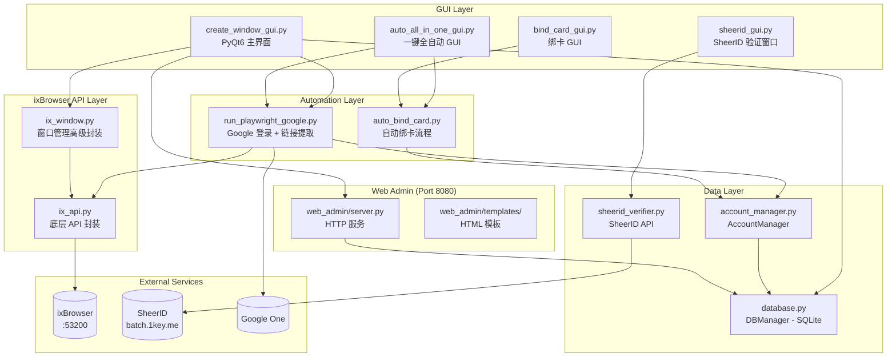

# CLAUDE.md

> **Last Updated**: 2026-01-19 21:09:19

This file provides guidance to Claude Code (claude.ai/code) when working with code in this repository.

## Project Overview

**ixBrowser Automation Tool** - 基于 Python/PyQt6 的 ixBrowser 自动化管理工具，用于批量管理浏览器窗口、自动化 Google 学生验证流程 (SheerID) 及账号状态检测。

### Tech Stack
- **Language**: Python 3.x
- **GUI**: PyQt6
- **Browser Automation**: Playwright (CDP), Selenium
- **Database**: SQLite
- **ixBrowser SDK**: ixbrowser-local-api

## Architecture Diagram



## Module Index

| Module | Path | Description |
|--------|------|-------------|
| **ix_api** | `ix_api.py` | ixBrowser 底层 API 封装 (open/close/create/delete) |
| **ix_window** | `ix_window.py` | 窗口管理高级封装 (批量创建、模板克隆、代理分配) |
| **database** | `database.py` | SQLite 数据库管理 (DBManager 类) |
| **account_manager** | `account_manager.py` | 账号状态转换封装 (AccountManager 类) |
| **run_playwright_google** | `run_playwright_google.py` | Google 登录 + SheerID 链接自动提取 |
| **auto_bind_card** | `auto_bind_card.py` | 自动绑卡流程 (处理嵌套 iframe) |
| **sheerid_verifier** | `sheerid_verifier.py` | SheerID API 调用 (SheerIDVerifier 类) |
| **create_window_gui** | `create_window_gui.py` | PyQt6 主界面 + WorkerThread |
| **web_admin** | `web_admin/` | Web 管理界面 (Port 8080) |

## Quick Start

```bash
# Install dependencies
pip install -r requirements.txt

# Install Playwright browser driver
playwright install chromium

# Run main GUI
python create_window_gui.py
```

### Testing Commands

```bash
# Test ixBrowser API connection
python test_ixbrowser_api.py

# Test SheerID verifier
python sheerid_verifier.py

# Test auto card binding
python auto_bind_card.py
```

## Core Classes

### DBManager (database.py)

SQLite 数据库管理，是数据层的核心类。

**Key Methods**:
- `init_db()` - 初始化数据库，自动从文本文件导入
- `upsert_account(email, password, ...)` - 插入或更新账号
- `update_status(email, status, message)` - 更新账号状态
- `get_accounts_by_status(status)` - 按状态查询
- `export_to_files()` - 导出到文本文件

**Account Status Flow**:
```
pending → link_ready → verified → subscribed
                 ↘ ineligible
                 ↘ error
```

### AccountManager (account_manager.py)

高层状态管理封装，自动同步文件。

**Key Methods**:
- `save_link(line)` - 保存到 link_ready 状态
- `move_to_verified(line)` - 移动到已验证状态
- `move_to_subscribed(line)` - 移动到已订阅状态
- `move_to_ineligible(line)` - 移动到无资格状态
- `move_to_error(line)` - 移动到错误状态

### ixBrowser API Functions (ix_api.py)

底层 API 封装，使用 ixbrowser-local-api SDK。

**Key Functions**:
- `openBrowser(profile_id)` - 打开窗口，返回 WebSocket endpoint
- `closeBrowser(profile_id)` - 关闭窗口
- `createBrowser(name, proxy_config)` - 创建新窗口
- `deleteBrowser(profile_id)` - 删除窗口
- `get_profile_list(page, limit)` - 获取窗口列表

### SheerIDVerifier (sheerid_verifier.py)

SheerID 批量验证 API 客户端。

**Key Methods**:
- `verify_batch(verification_ids, callback)` - 批量验证 (SSE 流)
- `_get_csrf_token()` - 获取 CSRF token

## Key Dependencies

| Package | Purpose |
|---------|---------|
| PyQt6 | GUI Framework |
| playwright | Browser Automation (CDP) |
| ixbrowser-local-api | ixBrowser Official SDK |
| pyotp | 2FA Code Generation |
| deep-translator | Multi-language Translation |
| selenium | Backup Browser Control |

## Development Notes

### Prerequisites
1. **ixBrowser must be running**: All window operations depend on local service (port 53200)
2. **Playwright CDP**: Get WebSocket endpoint via `openBrowser()`, then use `connect_over_cdp()`

### Data Flow
- **Database First**: Modify account status via DBManager/AccountManager (auto-sync to files)
- **Thread Safety**: File write and DB operations use `threading.Lock`

### File Separator
账号文件默认使用 `----` 作为分隔符，可在文件顶部配置：
```
分隔符="----"
email----password----backup_email----2fa_secret
```

## Status Files Mapping

| Status | File |
|--------|------|
| link_ready | sheerIDlink.txt |
| verified | 已验证未绑卡.txt |
| subscribed | 已绑卡号.txt |
| ineligible | 无资格号.txt |
| error | 超时或其他错误.txt |
| pending (eligible) | 有资格待验证号.txt |

---

*Generated by /init-project*
