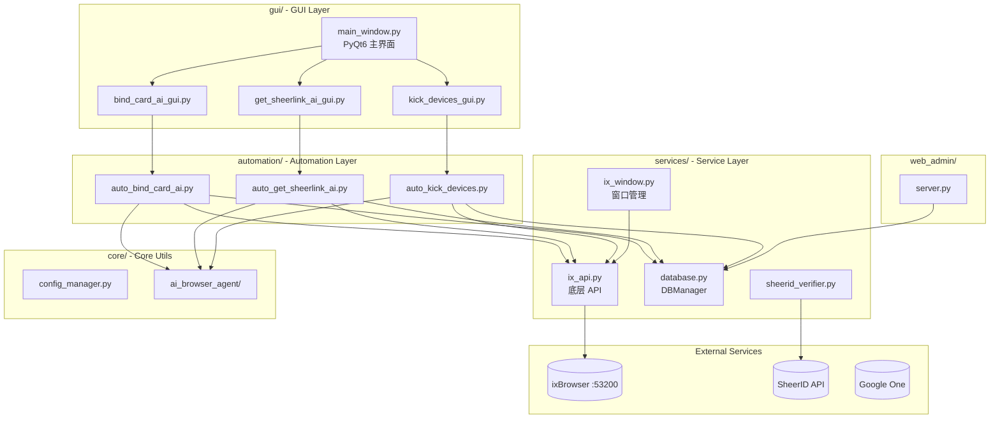

# CLAUDE.md

> **Last Updated**: 2026-01-23

This file provides guidance to Claude Code (claude.ai/code) when working with code in this repository.

## Project Overview

**ixBrowser Automation Tool** - 基于 Python/PyQt6 的 ixBrowser 自动化管理工具，用于批量管理浏览器窗口、自动化 Google 学生验证流程 (SheerID) 及账号状态检测。

### Tech Stack
- **Language**: Python 3.x
- **GUI**: PyQt6
- **Browser Automation**: Playwright (CDP), Selenium
- **Database**: SQLite
- **ixBrowser SDK**: ixbrowser-local-api

## Directory Structure

```
auto_bitbrowser/
├── main.py                    # 统一入口
├── gui/                       # GUI 窗口模块
│   ├── main_window.py         # PyQt6 主界面
│   ├── bind_card_ai_gui.py    # AI 绑卡窗口
│   ├── get_sheerlink_ai_gui.py # AI SheerLink 窗口
│   ├── modify_2sv_phone_gui.py # 2SV 手机号修改窗口
│   ├── modify_authenticator_gui.py # 身份验证器修改窗口
│   ├── replace_phone_gui.py   # 替换手机号窗口
│   ├── replace_email_v2_gui.py # 替换辅助邮箱 V2 窗口
│   ├── kick_devices_gui.py    # 踢出设备窗口
│   ├── comprehensive_query_gui.py # 综合查询窗口
│   ├── config_ui.py           # 配置管理界面
│   └── sheerid_gui_v2.py      # SheerID 验证窗口
├── automation/                # 自动化脚本模块
│   ├── auto_bind_card_ai.py   # AI 自动绑卡
│   ├── auto_get_sheerlink_ai.py # AI 获取 SheerLink
│   ├── auto_modify_2sv_phone.py # 自动修改 2SV 手机
│   ├── auto_modify_authenticator.py # 自动修改验证器
│   ├── auto_replace_email.py  # 自动替换邮箱
│   ├── auto_replace_phone.py  # 自动替换手机
│   ├── auto_kick_devices.py   # 自动踢出设备
│   └── auto_subscribe.py      # 自动订阅
├── services/                  # 服务层模块
│   ├── database.py            # SQLite 数据库管理
│   ├── ix_api.py              # ixBrowser 底层 API
│   ├── ix_window.py           # 窗口管理高级封装
│   ├── sheerid_verifier.py    # SheerID API 客户端
│   ├── account_manager.py     # 账号状态管理
│   ├── email_code_reader.py   # 邮箱验证码读取
│   ├── proxy_allocator.py     # 代理分配
│   └── data_store.py          # 数据存储
├── core/                      # 核心工具模块
│   ├── ai_browser_agent/      # AI Agent 子模块
│   ├── config_manager.py      # 配置管理
│   ├── data_parser.py         # 数据解析
│   └── retry_helper.py        # 重试助手
├── ui/                        # UI 资源
│   ├── icons/                 # 图标文件
│   ├── icons.py               # 图标定义
│   └── styles.py              # 样式定义
├── web_admin/                 # Web 管理界面
│   ├── server.py              # HTTP 服务器
│   ├── templates/             # HTML 模板
│   └── static/                # 静态资源
├── tests/                     # 测试目录
├── data/                      # 数据/配置文件
└── assets/                    # 静态资源
```

## Architecture Diagram



## Module Index

| Module | Path | Description |
|--------|------|-------------|
| **main** | `main.py` | 统一入口，启动 GUI |
| **gui** | `gui/` | 所有 PyQt6 GUI 窗口 |
| **automation** | `automation/` | AI Agent 自动化脚本 |
| **services** | `services/` | 数据库、API、外部服务 |
| **core** | `core/` | 核心工具模块 |
| **web_admin** | `web_admin/` | Web 管理界面 (Port 8080) |

## Submodule Navigation

| Module | CLAUDE.md |
|--------|-----------|
| core | [`core/CLAUDE.md`](core/CLAUDE.md) |
| core/ai_browser_agent | [`core/ai_browser_agent/CLAUDE.md`](core/ai_browser_agent/CLAUDE.md) |
| web_admin | [`web_admin/CLAUDE.md`](web_admin/CLAUDE.md) |

## Quick Start

```bash
# Install dependencies
pip install -r requirements.txt

# Install Playwright browser driver
playwright install chromium

# Run main GUI
python main.py
```

### Testing Commands

```bash
# Run tests
python -m pytest tests/

# Test ixBrowser API connection
python tests/test_ixbrowser_api.py
```

## Core Classes

### DBManager (services/database.py)

SQLite 数据库管理，是数据层的核心类。

**Key Methods**:
- `init_db()` - 初始化数据库，自动从文本文件导入
- `upsert_account(email, password, ...)` - 插入或更新账号
- `update_status(email, status, message)` - 更新账号状态
- `get_accounts_by_status(status)` - 按状态查询
- `export_to_files()` - 导出到文本文件

**Account Status Flow**:
```
pending → link_ready → verified → subscribed
                 ↘ ineligible
                 ↘ error
```

### ixBrowser API (services/ix_api.py)

底层 API 封装，使用 ixbrowser-local-api SDK。

**Key Functions**:
- `openBrowser(profile_id)` - 打开窗口，返回 WebSocket endpoint
- `closeBrowser(profile_id)` - 关闭窗口
- `createBrowser(name, proxy_config)` - 创建新窗口
- `deleteBrowser(profile_id)` - 删除窗口
- `get_profile_list(page, limit)` - 获取窗口列表

### SheerIDVerifier (services/sheerid_verifier.py)

SheerID 批量验证 API 客户端。

**Key Methods**:
- `verify_batch(verification_ids, callback)` - 批量验证 (SSE 流)
- `_get_csrf_token()` - 获取 CSRF token

## Import Conventions

```python
# 导入服务层
from services.database import DBManager
from services.ix_api import openBrowser, closeBrowser
from services.ix_window import get_browser_list

# 导入自动化模块
from automation.auto_bind_card_ai import auto_bind_card_ai
from automation.auto_kick_devices import auto_kick_devices

# 导入 GUI 模块
from gui.main_window import MainWindow
from gui.bind_card_ai_gui import BindCardAIDialog

# 导入核心工具
from core.config_manager import ConfigManager
from core.ai_browser_agent import BrowserAgent
```

## Key Dependencies

| Package | Purpose |
|---------|---------|
| PyQt6 | GUI Framework |
| playwright | Browser Automation (CDP) |
| ixbrowser-local-api | ixBrowser Official SDK |
| pyotp | 2FA Code Generation |
| deep-translator | Multi-language Translation |
| selenium | Backup Browser Control |

## Development Notes

### Prerequisites
1. **ixBrowser must be running**: All window operations depend on local service (port 53200)
2. **Playwright CDP**: Get WebSocket endpoint via `openBrowser()`, then use `connect_over_cdp()`

### Data Flow
- **Database First**: Modify account status via DBManager/AccountManager (auto-sync to files)
- **Thread Safety**: File write and DB operations use `threading.Lock`

### File Separator
账号文件默认使用 `----` 作为分隔符，可在文件顶部配置：
```
分隔符="----"
email----password----backup_email----2fa_secret
```

## Status Files Mapping

| Status | File |
|--------|------|
| link_ready | sheerIDlink.txt |
| verified | 已验证未绑卡.txt |
| subscribed | 已绑卡号.txt |
| ineligible | 无资格号.txt |
| error | 超时或其他错误.txt |
| pending (eligible) | 有资格待验证号.txt |

---

*Last refactored: 2026-01-23 - Directory structure optimization*
