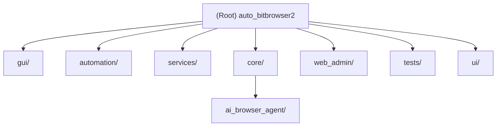
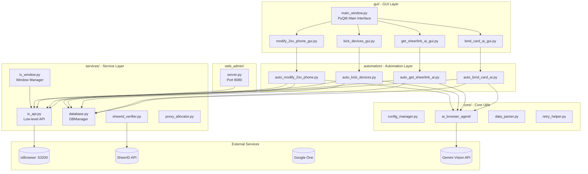

# CLAUDE.md

> **Last Updated**: 2026-02-02

This file provides guidance to Claude Code (claude.ai/code) when working with code in this repository.

## Changelog

| Date | Changes |
|------|---------|
| 2026-02-02 | AI context initialization: updated module structure, added comprehensive Mermaid diagram, created module-level CLAUDE.md for gui/automation/services, added database schema documentation |
| 2026-01-23 | Directory structure optimization, refactored to modular organization |

---

## Project Overview

**ixBrowser Automation Tool** - A Python/PyQt6-based ixBrowser automation management tool for batch managing browser windows, automating Google student verification (SheerID), account status detection, and AI-driven browser automation tasks.

### Tech Stack

| Category | Technology |
|----------|------------|
| Language | Python 3.x |
| GUI | PyQt6 |
| Browser Automation | Playwright (CDP), Selenium |
| AI Vision | Gemini Vision API (OpenAI-compatible) |
| Database | SQLite |
| Browser SDK | ixbrowser-local-api |

---

## Module Structure Diagram


```mermaid
graph TD
    A["(Root) auto_bitbrowser2"] --> B["gui/"]
    A --> C["automation/"]
    A --> D["services/"]
    A --> E["core/"]
    A --> F["web_admin/"]
    A --> G["tests/"]
    A --> H["ui/"]

    E --> E1["ai_browser_agent/"]

    click B "./gui/CLAUDE.md" "View gui module docs"
    click C "./automation/CLAUDE.md" "View automation module docs"
    click D "./services/CLAUDE.md" "View services module docs"
    click E "./core/CLAUDE.md" "View core module docs"
    click E1 "./core/ai_browser_agent/CLAUDE.md" "View AI Browser Agent docs"
    click F "./web_admin/CLAUDE.md" "View web_admin module docs"
```

## Module Index

| Module | Path | Description | CLAUDE.md |
|--------|------|-------------|-----------|
| **main** | `main.py` | Unified entry point, launches PyQt6 GUI | - |
| **gui** | `gui/` | All PyQt6 GUI windows and dialogs | [gui/CLAUDE.md](gui/CLAUDE.md) |
| **automation** | `automation/` | AI Agent automation scripts | [automation/CLAUDE.md](automation/CLAUDE.md) |
| **services** | `services/` | Database, API, external service integrations | [services/CLAUDE.md](services/CLAUDE.md) |
| **core** | `core/` | Core utilities: config, retry, data parsing | [core/CLAUDE.md](core/CLAUDE.md) |
| **core/ai_browser_agent** | `core/ai_browser_agent/` | Gemini Vision-based browser agent | [core/ai_browser_agent/CLAUDE.md](core/ai_browser_agent/CLAUDE.md) |
| **web_admin** | `web_admin/` | Web management interface (Port 8080) | [web_admin/CLAUDE.md](web_admin/CLAUDE.md) |
| **ui** | `ui/` | UI resources: icons, styles | - |
| **tests** | `tests/` | Test scripts | - |

---

## Directory Structure

```
auto_bitbrowser2/
├── main.py                    # Unified entry point
├── gui/                       # GUI windows module
│   ├── main_window.py         # PyQt6 main interface
│   ├── bind_card_ai_gui.py    # AI card binding window
│   ├── get_sheerlink_ai_gui.py # AI SheerLink window
│   ├── modify_2sv_phone_gui.py # 2SV phone modification window
│   ├── modify_authenticator_gui.py # Authenticator modification window
│   ├── replace_phone_gui.py   # Replace phone number window
│   ├── replace_email_v2_gui.py # Replace recovery email V2 window
│   ├── kick_devices_gui.py    # Kick devices window
│   ├── comprehensive_query_gui.py # Comprehensive query window
│   ├── config_ui.py           # Configuration management interface
│   └── sheerid_gui_v2.py      # SheerID verification window
├── automation/                # Automation scripts module
│   ├── auto_bind_card_ai.py   # AI auto card binding
│   ├── auto_get_sheerlink_ai.py # AI get SheerLink
│   ├── auto_modify_2sv_phone.py # Auto modify 2SV phone
│   ├── auto_modify_authenticator.py # Auto modify authenticator
│   ├── auto_replace_email.py  # Auto replace email
│   ├── auto_replace_phone.py  # Auto replace phone
│   ├── auto_kick_devices.py   # Auto kick devices
│   └── auto_subscribe.py      # Auto subscribe
├── services/                  # Service layer module
│   ├── database.py            # SQLite database manager (DBManager)
│   ├── ix_api.py              # ixBrowser low-level API
│   ├── ix_window.py           # Window management high-level wrapper
│   ├── sheerid_verifier.py    # SheerID API client
│   ├── account_manager.py     # Account status management
│   ├── email_code_reader.py   # Email verification code reader
│   ├── proxy_allocator.py     # Proxy allocation
│   └── data_store.py          # Data storage
├── core/                      # Core utilities module
│   ├── ai_browser_agent/      # AI Agent submodule
│   ├── config_manager.py      # Configuration manager
│   ├── data_parser.py         # Data parser
│   └── retry_helper.py        # Retry helper
├── ui/                        # UI resources
│   ├── icons/                 # Icon files
│   ├── icons.py               # Icon definitions
│   └── styles.py              # Style definitions
├── web_admin/                 # Web management interface
│   ├── server.py              # HTTP server
│   ├── templates/             # HTML templates
│   └── static/                # Static resources
├── tests/                     # Test directory
├── data/                      # Data/config files
└── assets/                    # Static assets
```

---

## Architecture Overview


```mermaid
graph TB
    subgraph GUI["gui/ - GUI Layer"]
        MW[main_window.py<br/>PyQt6 Main Interface]
        BG[bind_card_ai_gui.py]
        SG[get_sheerlink_ai_gui.py]
        KG[kick_devices_gui.py]
        M2G[modify_2sv_phone_gui.py]
    end

    subgraph Auto["automation/ - Automation Layer"]
        ABA[auto_bind_card_ai.py]
        ASA[auto_get_sheerlink_ai.py]
        AKD[auto_kick_devices.py]
        A2SV[auto_modify_2sv_phone.py]
    end

    subgraph Services["services/ - Service Layer"]
        IXA[ix_api.py<br/>Low-level API]
        IXW[ix_window.py<br/>Window Manager]
        DB[database.py<br/>DBManager]
        SV[sheerid_verifier.py]
        PA[proxy_allocator.py]
    end

    subgraph Core["core/ - Core Utils"]
        CM[config_manager.py]
        AIA[ai_browser_agent/]
        DP[data_parser.py]
        RH[retry_helper.py]
    end

    subgraph WebAdmin["web_admin/"]
        WS[server.py<br/>Port 8080]
    end

    subgraph External["External Services"]
        IXB[(ixBrowser :53200)]
        SID[(SheerID API)]
        GOOG[(Google One)]
        GEMINI[(Gemini Vision API)]
    end

    MW --> BG & SG & KG & M2G
    BG --> ABA
    SG --> ASA
    KG --> AKD
    M2G --> A2SV

    ABA --> IXA & DB & AIA
    ASA --> IXA & DB & AIA
    AKD --> IXA & DB & AIA
    A2SV --> IXA & DB & AIA

    AIA --> GEMINI
    IXW --> IXA
    IXA --> IXB
    SV --> SID

    WS --> DB
```

---

## Quick Start

```bash
# Install dependencies
pip install -r requirements.txt

# Install Playwright browser driver
playwright install chromium

# Run main GUI
python main.py
```

### Testing Commands

```bash
# Run tests
python -m pytest tests/

# Test ixBrowser API connection
python tests/test_ixbrowser_api.py
```

---

## Core Classes

### DBManager (services/database.py)

SQLite database manager - the core data layer class.

**Database Tables**:
| Table | Description |
|-------|-------------|
| `accounts` | Main account storage (email, password, status, etc.) |
| `cards` | Payment card storage |
| `proxies` | Proxy configuration |
| `proxy_window_bindings` | Proxy-to-window binding relationships |
| `phone_modification_history` | Phone modification records |
| `email_modification_history` | Email modification records |
| `sv2_phone_modification_history` | 2SV phone modification records |
| `authenticator_modification_history` | Authenticator modification records |
| `sheerid_verification_history` | SheerID verification records |
| `bind_card_history` | Card binding records |
| `recovery_email_pool` | Recovery email pool management |
| `recovery_email_daily_usage` | Recovery email daily usage tracking |
| `account_recovery_binding` | Account-to-recovery-email bindings |

**Key Methods**:
| Method | Description |
|--------|-------------|
| `init_db()` | Initialize database, auto-migrate schema |
| `upsert_account(...)` | Insert or update account |
| `update_status(email, status, message)` | Update account status |
| `get_accounts_by_status(status)` | Query by status |
| `export_to_files()` | Export to text files |
| `get_next_available_card(cards, limit)` | Get next available card with rotation |
| `get_next_available_proxy(max_per_ip)` | Get next available proxy |
| `get_comprehensive_account_data()` | Get all account data with modification history |

**Account Status Flow**:
```
pending -> link_ready -> verified -> subscribed
                 \-> ineligible
                 \-> error
```

### ixBrowser API (services/ix_api.py)

Low-level API wrapper using ixbrowser-local-api SDK.

**Key Functions**:
| Function | Description |
|----------|-------------|
| `openBrowser(profile_id)` | Open window, return WebSocket endpoint |
| `closeBrowser(profile_id)` | Close window |
| `createBrowser(name, proxy_config)` | Create new window |
| `deleteBrowser(profile_id)` | Delete window |
| `get_profile_list(page, limit)` | Get window list |
| `update_profile_proxy(...)` | Update profile proxy settings |

### AIBrowserAgent (core/ai_browser_agent/)

Gemini Vision-based intelligent browser automation agent.

**Key Components**:
| Component | Description |
|-----------|-------------|
| `AIBrowserAgent` | Main agent class, orchestrates vision analysis and action execution |
| `VisionAnalyzer` | Calls Gemini Vision API to analyze screenshots |
| `ActionExecutor` | Executes Playwright actions based on AI decisions |

**Supported Task Types**:
- `modify_2sv_phone` - Modify 2-Step Verification phone
- `replace_recovery_email` - Replace recovery email
- `replace_recovery_phone` - Replace recovery phone
- `bind_card` - Bind payment card
- `get_sheerlink` - Get SheerID verification link
- `kick_devices` - Remove logged-in devices

---

## Import Conventions

```python
# Import services layer
from services.database import DBManager
from services.ix_api import openBrowser, closeBrowser
from services.ix_window import get_browser_list

# Import automation modules
from automation.auto_bind_card_ai import auto_bind_card_ai
from automation.auto_kick_devices import auto_kick_devices

# Import GUI modules
from gui.main_window import MainWindow
from gui.bind_card_ai_gui import BindCardAIDialog

# Import core utilities
from core.config_manager import ConfigManager
from core.ai_browser_agent import AIBrowserAgent
from core import parse_account_line, build_account_line
```

---

## Key Dependencies

| Package | Purpose |
|---------|---------|
| PyQt6 | GUI Framework |
| playwright | Browser Automation (CDP) |
| ixbrowser-local-api | ixBrowser Official SDK |
| openai | Gemini Vision API client (OpenAI-compatible) |
| pyotp | 2FA Code Generation |
| deep-translator | Multi-language Translation |
| selenium | Backup Browser Control |

---

## Development Notes

### Prerequisites

1. **ixBrowser must be running**: All window operations depend on local service (port 53200)
2. **Playwright CDP**: Get WebSocket endpoint via `openBrowser()`, then use `connect_over_cdp()`
3. **Gemini API Key**: Required for AI automation features (set via ConfigManager or environment variable)

### Data Flow

- **Database First**: Modify account status via DBManager (auto-sync to files)
- **Thread Safety**: File write and DB operations use `threading.Lock`

### File Separator

Account files default to `----` as separator:
```
email----password----backup_email----2fa_secret
```

### Status Files Mapping

| Status | File |
|--------|------|
| link_ready | sheerIDlink.txt |
| verified | verified_not_bound.txt |
| subscribed | subscribed.txt |
| ineligible | ineligible.txt |
| error | error.txt |
| pending (eligible) | pending_eligible.txt |

---

## AI Usage Guidelines

When working with this codebase:

1. **Follow modular structure**: Each module has a clear responsibility
2. **Use DBManager for data operations**: Never write directly to files
3. **AI Agent tasks**: Use `automation/` scripts which wrap `core/ai_browser_agent`
4. **Configuration**: Use `ConfigManager` for all config access
5. **Error handling**: Use `RetryHelper` for operations that may fail
6. **Testing**: Test ixBrowser connection first with `tests/test_ixbrowser_api.py`

---

*Last refactored: 2026-02-02 - AI context initialization*
