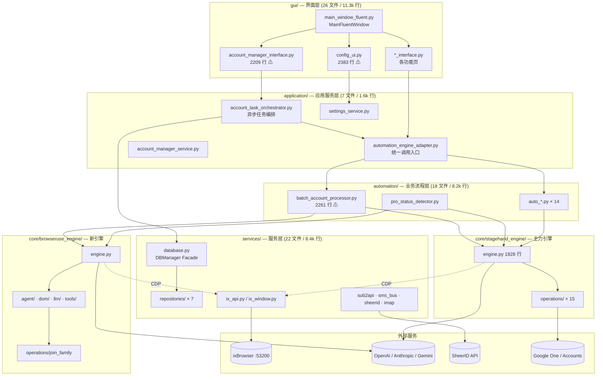

# CLAUDE.md

> **Last Updated**: 2026-09-23

本文件为 Claude Code (claude.ai/code) 在本仓库工作时提供指引。

## Changelog

| Date | Changes |
| ------ | --------- |
| 2026-09-23 | **全面重写**：修正已失效的架构描述（`core/ai_browser_agent/` 早已删除）；补充双 AI 引擎、`application/` 应用服务层、`services/repositories/` 仓储层、Fluent GUI 实际界面清单；新增 `pytest.ini` 与测试基线说明 |
| 2026-02-02 | AI context 初始化（**此版本描述的架构已失效**） |
| 2026-01-23 | 目录结构优化，重构为模块化组织 |

---

## 项目概述

**ixBrowser 自动化管理工具** —— 基于 Python + PyQt6-Fluent-Widgets 的桌面应用，
驱动 ixBrowser 指纹浏览器批量完成 Google 账号自动化：SheerID 学生验证、绑卡订阅、
家庭组邀请/加入、2SV 手机与辅助邮箱/验证器修改、设备踢出、Pro 会员状态检测。

- 规模：**154 个 Python 文件 / 约 48,000 行**
- 入口：`main.py` → `gui/main_window_fluent.py::run_fluent_app()`

### 技术栈

| 分类 | 技术 |
| ------ | ------ |
| 语言 | Python 3.13（`.venv`） |
| GUI | PyQt6 + PyQt6-Fluent-Widgets（`FluentWindow` 左导航布局） |
| 浏览器自动化 | Playwright（CDP 连接 ixBrowser）、Selenium（备用） |
| AI 引擎 | **Stagehand SDK**（主力）+ **BrowserUse 自研引擎**（新，迁移中） |
| LLM | OpenAI / Anthropic / Google Gemini（通过统一适配层） |
| 数据库 | SQLite（`accounts.db`） |
| 浏览器 SDK | `ixbrowser-local-api`（本地服务端口 **53200**） |

---

## 快速开始

```powershell
# 依赖（运行时 + 开发）
.\.venv\Scripts\python.exe -m pip install -r requirements.txt
.\.venv\Scripts\python.exe -m pip install -r requirements-dev.txt
.\.venv\Scripts\python.exe -m playwright install chromium

# 启动 GUI（长驻进程，需在用户终端手动运行）
.\.venv\Scripts\python.exe main.py

# 跑测试
.\.venv\Scripts\python.exe -m pytest -q

# 手动诊断 ixBrowser 连接（需 ixBrowser 已启动）
.\.venv\Scripts\python.exe tests\test_ixbrowser_api.py
```

---

## 架构总览


```mermaid
graph TB
    subgraph L1["gui/ — 界面层 (26 文件 / 11.3k 行)"]
        MWF["main_window_fluent.py<br/>MainFluentWindow"]
        AMI["account_manager_interface.py<br/>2209 行 ⚠"]
        CFG["config_ui.py<br/>2383 行 ⚠"]
        FEAT["*_interface.py<br/>各功能页"]
    end

    subgraph L2["application/ — 应用服务层 (7 文件 / 1.6k 行)"]
        ATO["account_task_orchestrator.py<br/>异步任务编排"]
        AEA["automation_engine_adapter.py<br/>统一调用入口"]
        AMS["account_manager_service.py"]
        SS["settings_service.py"]
    end

    subgraph L3["automation/ — 业务流程层 (18 文件 / 8.2k 行)"]
        BAP["batch_account_processor.py<br/>2261 行 ⚠"]
        PSD["pro_status_detector.py"]
        AUTO["auto_*.py × 14"]
    end

    subgraph L4A["core/stagehand_engine/ — 主力引擎"]
        SE["engine.py 1828 行"]
        OPS["operations/ × 15"]
    end

    subgraph L4B["core/browseruse_engine/ — 新引擎"]
        BE["engine.py"]
        AG["agent/ · dom/ · llm/ · tools/"]
        BOPS["operations/join_family"]
    end

    subgraph L5["services/ — 服务层 (22 文件 / 8.4k 行)"]
        DB["database.py<br/>DBManager Facade"]
        REPO["repositories/ × 7"]
        IXA["ix_api.py / ix_window.py"]
        EXT["sub2api · sms_bus · sheerid · imap"]
    end

    subgraph EXTSVC["外部服务"]
        IXB[("ixBrowser :53200")]
        LLM[("OpenAI / Anthropic / Gemini")]
        SID[("SheerID API")]
        GOOG[("Google One / Accounts")]
    end

    MWF --> AMI & CFG & FEAT
    AMI --> ATO --> AEA --> BAP & AUTO
    FEAT --> AEA
    CFG --> SS
    BAP --> SE & BE
    PSD --> SE & BE
    AUTO --> SE
    SE --> OPS --> GOOG
    BE --> AG --> BOPS
    SE & BE -.CDP.-> IXA --> IXB
    SE & BE --> LLM
    DB --> REPO
    EXT --> SID
    ATO --> DB
```

### 分层约定

```text
gui/  →  application/  →  automation/  →  core/ 引擎
                      ↘                 ↘
                        services/  ←────┘（仅 ix_api，延迟 import）
```

- **GUI 不直接调 `automation/` 或 `services/`**，一律经 `application/` 层
- `application/automation_engine_adapter.py` 是 application → 底层的**唯一入口**

---

## 模块索引

| 模块 | 路径 | 职责 | 子文档 |
| ------ | ------ | ------ | -------- |
| **入口** | `main.py` | 启动 Fluent GUI | - |
| **gui** | `gui/` | PyQt6-Fluent 界面（13 个导航页） | [gui/CLAUDE.md](gui/CLAUDE.md) |
| **application** | `application/` | 跨模块业务编排，隔离 GUI 与底层 | - |
| **automation** | `automation/` | 具体自动化业务流程 | [automation/CLAUDE.md](automation/CLAUDE.md) |
| **core** | `core/` | 双 AI 引擎、配置、重试、解析 | [core/CLAUDE.md](core/CLAUDE.md) |
| **services** | `services/` | 数据库、ixBrowser API、外部服务 | [services/CLAUDE.md](services/CLAUDE.md) |
| **web_admin** | `web_admin/` | Web 管理界面（仅 116 行，基本未启用） | [web_admin/CLAUDE.md](web_admin/CLAUDE.md) |
| **tests** | `tests/` | pytest 用例 + 手动诊断脚本 | - |

---

## 目录结构

```text
auto_bitbrowser2/
├── main.py                          # 入口 → gui.main_window_fluent.run_fluent_app()
├── pytest.ini                       # 测试配置（排除手动诊断脚本）
├── config.json                      # 本地配置（gitignore，敏感字段加密）
├── accounts.db                      # SQLite 主库（gitignore）
│
├── gui/                             # 界面层
│   ├── main_window_fluent.py        # MainFluentWindow，左导航 13 项
│   ├── base_interface.py            # BaseInterface / BaseDialogInterface
│   ├── ai_task_interface.py         # AI 任务页基类
│   ├── fluent_utils.py              # 主题、图标、消息框
│   ├── home_interface.py            # 首页（窗口管理）
│   ├── account_manager_interface.py # 账号管理 ⚠ 2209 行
│   ├── config_ui.py                 # 配置界面 ⚠ 2383 行
│   ├── setting_interface.py         # 设置页
│   ├── import_totp_interface.py     # TOTP 密钥导入（二维码识别）
│   ├── sheerid_interface.py         # SheerID 验证
│   ├── bindcard_interface.py        # 绑卡订阅
│   ├── sheerlink_interface.py       # 获取 SheerLink
│   ├── replacephone_interface.py    # 替换手机号
│   ├── replaceemail_interface.py    # 替换辅助邮箱
│   ├── modify2sv_interface.py       # 修改 2SV 手机
│   ├── modifyauth_interface.py      # 修改验证器
│   ├── kickdevices_interface.py     # 踢出设备
│   ├── query_interface.py           # 综合查询
│   ├── placeholder_interface.py     # 占位页（全自动订阅尚未实现）
│   └── data_management/             # 账号/卡片/代理标签页与批量导入对话框
│
├── application/                     # 应用服务层
│   ├── automation_engine_adapter.py # ★ application → 底层的唯一入口
│   ├── account_task_orchestrator.py # 异步批量任务编排
│   ├── account_manager_service.py   # 账号查询与批量参数准备
│   ├── settings_service.py          # 设置页编排
│   ├── sub2api_settings_service.py  # Sub2API / SMS-Bus 配置
│   └── sheerid_service.py           # SheerID 业务
│
├── automation/                      # 业务流程层
│   ├── batch_account_processor.py   # ⚠ 2261 行，批量调度核心
│   ├── pro_status_detector.py       # Pro / 家庭组状态检测
│   ├── auto_google_login.py         # Google 登录（含 TOTP）
│   ├── auto_join_family.py          # 加入家庭组 → 已迁 BrowserUseEngine
│   ├── auto_enable_family_sharing.py
│   ├── auto_bind_card_ai.py         # 绑卡
│   ├── auto_get_sheerlink_ai.py     # 获取 SheerID 链接
│   ├── auto_subscribe.py            # 订阅
│   ├── auto_replace_email.py        # 换辅助邮箱（1094 行）
│   ├── auto_replace_phone.py        # 换手机号（849 行）
│   ├── auto_replace_recovery_email.py / auto_replace_recovery_phone.py
│   ├── auto_modify_2sv_phone.py / auto_modify_authenticator.py
│   ├── auto_kick_devices.py         # 踢出设备
│   ├── auto_unlock_403.py           # 解封 403
│   └── auto_antigravity_oauth.py    # OAuth 授权
│
├── core/                            # 核心层
│   ├── config_manager.py            # ConfigManager，847 行，含敏感字段加解密
│   ├── retry_helper.py              # RetryHelper / FailedTaskQueue / with_retry
│   ├── data_parser.py               # parse_account_line / build_account_line
│   ├── totp_extractor/              # 二维码 → TOTP 密钥
│   ├── stagehand_engine/            # ★ 主力引擎
│   │   ├── engine.py                # StagehandGoogleEngine（1828 行）
│   │   ├── config.py types.py constants.py
│   │   └── operations/              # 15 个 Operation 类
│   └── browseruse_engine/           # ★ 新引擎（自研 browser-use 架构）
│       ├── engine.py protocol.py types.py
│       ├── agent/                   # service / message_manager / prompts / views
│       ├── dom/                     # service / serializer / views
│       ├── llm/                     # base + adapters（OpenAI/Anthropic/Google）
│       ├── tools/                   # registry / executor / actions
│       └── operations/join_family.py
│
├── services/                        # 服务层
│   ├── database.py                  # DBManager，1414 行，Facade
│   ├── repositories/                # 从 database.py 下沉的仓储
│   │   ├── account_repository.py    account_io_repository.py
│   │   ├── account_refresh_repository.py  card_repository.py
│   │   ├── proxy_repository.py      history_repository.py
│   │   └── recovery_email_repository.py
│   ├── ix_api.py / ix_window.py     # ixBrowser 底层 API / 窗口高层封装
│   ├── sub2api_client.py            # Sub2API（aiohttp 异步）
│   ├── sms_bus_client.py            # SMS-Bus 接码平台
│   ├── sheerid_verifier.py          # SheerID API
│   ├── email_code_reader.py         # Gmail IMAP 验证码
│   ├── recovery_email_manager.py    # 辅助邮箱池
│   ├── proxy_allocator.py / proxy_smart_allocator.py
│   ├── invite_lock.py               # 防止重复邀请的线程安全锁
│   ├── data_store.py                # cards / proxies 内存数据
│   └── account_manager.py
│
├── tests/                           # 22 文件 / 2587 行
├── docs/                            # 设计与实施计划文档
├── data/                            # 示例配置与数据
└── web_admin/                       # Web 管理界面（:8080，基本未启用）
```

---

## 双 AI 引擎（重要）

项目正处于引擎迁移中途，**两套引擎并存**，实现同一套 `EngineProtocol`，可互换。

| | **StagehandGoogleEngine** | **BrowserUseEngine** |
| --- | --- | --- |
| 路径 | `core/stagehand_engine/` | `core/browseruse_engine/` |
| 定位 | 主力，覆盖全部业务 | 新引擎，迁移目标 |
| 实现 | 封装 Stagehand SDK，自然语言指令 | 自研 browser-use 架构，Agent 循环 + DOM 索引 + 动作注册 |
| 覆盖操作 | **15 个** operations（登录/绑卡/2SV/换邮箱换号/踢设备/OAuth/订阅/解封/Pro/家庭组…） | **1 个**（`join_family`） |
| 使用方 | 全部 14 个 `auto_*.py` | `auto_join_family.py`、`batch_account_processor.py`、`pro_status_detector.py` |
| 版本 | `__version__ = "1.1.0"` | `__version__ = "1.0.0"` |

```python
# 两者接口一致
async with await StagehandGoogleEngine.connect_to_ixbrowser(browser_id) as engine:
    result = await engine.login(email, password, totp_secret)

engine = await BrowserUseEngine.connect_to_ixbrowser(browser_id)
try:
    result = await engine.run("搜索并订阅 Google One")
finally:
    await engine.stop()
```

> **新增功能时**：除非明确要求迁移，默认沿用 `stagehand_engine`（生态完整）。
> 涉及家庭组加入相关改动时注意它已在 `browseruse_engine` 上。

---

## 核心类

### DBManager (`services/database.py`)

SQLite 数据层 Facade。逻辑正在逐步下沉到 `services/repositories/`，**新代码优先写 repository**。

**数据表**（17 张，来自实际库）：

| 表 | 说明 |
| --- | --- |
| `accounts` | 账号主表 |
| `cards` | 支付卡 |
| `proxies` / `proxy_window_bindings` | 代理及窗口绑定 |
| `account_refresh_tasks` / `account_refresh_task_items` | 批量刷新任务与明细 |
| `phone_modification_history` | 手机号修改记录 |
| `email_modification_history` | 邮箱修改记录 |
| `sv2_phone_modification_history` | 2SV 手机修改记录 |
| `authenticator_modification_history` | 验证器修改记录 |
| `sheerid_verification_history` | SheerID 验证记录 |
| `bind_card_history` | 绑卡记录 |
| `recovery_email_pool` / `recovery_email_daily_usage` / `account_recovery_binding` | 辅助邮箱池、日用量、绑定关系 |
| `learned_rules` | 学习到的规则 |

**账号状态流转**：
```text
pending → link_ready → verified → subscribed
      ↘ ineligible / error
```

### ConfigManager (`core/config_manager.py`)

全局配置读写，**敏感字段自动加解密**（API key 等），支持点号路径。

```python
ConfigManager.get("ai_agent.model", "gemini-2.0-flash")
ConfigManager.set("theme", "dark")
ConfigManager.get_ai_provider_config("openai")   # 多 provider 配置
ConfigManager.get_enabled_ai_providers()
```

配置文件：`config.json`（gitignore），模板见 `data/config.example.json`。

### ixBrowser API (`services/ix_api.py` / `ix_window.py`)

| 函数 | 说明 |
| --- | --- |
| `openBrowser(profile_id)` | 打开窗口，返回 CDP WebSocket 端点 |
| `closeBrowser(profile_id)` | 关闭窗口 |
| `createBrowser(name, proxy_config)` / `deleteBrowser(profile_id)` | 增删窗口 |
| `get_profile_list(page, limit)` | 窗口列表 |
| `update_profile_proxy(...)` | 更新代理 |

---

## 导入约定

```python
# 应用服务层（GUI 应只依赖这一层）
from application.automation_engine_adapter import AutomationEngineAdapter
from application.account_task_orchestrator import AccountTaskOrchestrator

# 服务层
from services.database import DBManager
from services.repositories import AccountRepository, HistoryRepository
from services.ix_api import openBrowser, closeBrowser

# 引擎
from core.stagehand_engine import StagehandGoogleEngine, create_engine_from_config
from core.browseruse_engine import BrowserUseEngine   # 延迟导入，避免循环依赖

# 核心工具
from core import ConfigManager, RetryHelper, parse_account_line
```

---

## 测试

配置见 `pytest.ini`。当前基线：**72 passed, 5 failed, 1 skipped**。

```powershell
.\.venv\Scripts\python.exe -m pytest -q
```

### 已知失败（HEAD 上预先存在，非新引入）

```text
tests/test_account_repository.py::test_account_repository_unlock_and_available_pro_filters
tests/test_account_task_orchestrator.py::test_execute_single_join_family_success
tests/test_browseruse_engine.py::TestBrowserState::test_browser_state
tests/test_pro_status_family_detection.py::test_should_skip_secondary_family_check_when_payment_options_exist
tests/test_stagehand_engine.py::TestStagehandGoogleEngine::test_navigate
```

> 修改相关模块时不要误把这些当成自己引入的回归；有余力应顺手修掉。

### 手动诊断脚本（已在 pytest.ini 中排除）

`tests/test.py` 与 `tests/test_ixbrowser_api.py` 需要真实 ixBrowser 服务，
且后者在模块层替换 `sys.stdout`（会破坏 pytest 捕获）。只能手动单独运行。

---

## 开发注意事项

### 前置条件

1. **ixBrowser 必须已启动**：所有窗口操作依赖本地服务 `:53200`
2. **Playwright CDP**：`openBrowser()` 拿 WebSocket 端点 → `connect_over_cdp()`
3. **LLM API Key**：AI 引擎必需，经 `ConfigManager` 配置（加密存储）

### 已知技术债

| 项 | 说明 |
| --- | --- |
| 双引擎并存 | 迁移策略未定，两套错误处理/重试语义 |
| 超大文件 | `config_ui.py` 2383、`batch_account_processor.py` 2261、`account_manager_interface.py` 2209 |
| `core → services` 反向依赖 | `stagehand_engine/engine.py:89`、`browseruse_engine/engine.py:52` 用函数内延迟 import 规避循环，方向上仍是倒置 |
| `database.py` 未随仓储拆分瘦身 | 已拆出 7 个 repository，主文件仍 1414 行 |
| 「全自动订阅」未实现 | `PlaceholderInterface` 占位 |

### 数据与文件

- **数据库优先**：账号状态改动走 `DBManager` / repository，自动同步到文件，**不要直接写 txt**
- **线程安全**：文件写入与 DB 操作使用 `threading.Lock`
- **账号文件分隔符**：`----`
  ```text
  email----password----backup_email----2fa_secret
  ```

**状态 → 文件映射**：

| 状态 | 文件 |
| --- | --- |
| link_ready | `sheerIDlink.txt` |
| verified | `已验证未绑卡.txt` |
| subscribed | `已绑卡号.txt` |
| ineligible | `无资格号.txt` |
| error | `超时或其他错误.txt` |
| pending (eligible) | `有资格待验证号.txt` |

### 安全

- `config.json`、`*.db`、各类账号 txt 均已在 `.gitignore` 中，**不要提交**
- 工作目录内的 `accounts.db`、`已修改密钥.txt`、`已绑卡号.txt` 是明文真实数据，处理时注意不要外泄到日志或输出

---

## AI 协作准则

1. **遵循分层**：GUI → application → automation → core/services，不要跨层直连
2. **新增底层调用**走 `application/automation_engine_adapter.py`，别在 GUI 里直接 import `automation/`
3. **数据访问**优先写 `services/repositories/`，而不是继续给 `database.py` 加方法
4. **引擎选择**：默认 `stagehand_engine`；家庭组加入相关走 `browseruse_engine`
5. **配置读写**一律经 `ConfigManager`（敏感字段依赖它的加解密）
6. **易失败操作**用 `core/retry_helper.py` 的 `RetryHelper` / `with_retry`
7. **改完跑测试**：`pytest -q`，对照上面 5 个已知失败判断是否引入回归
